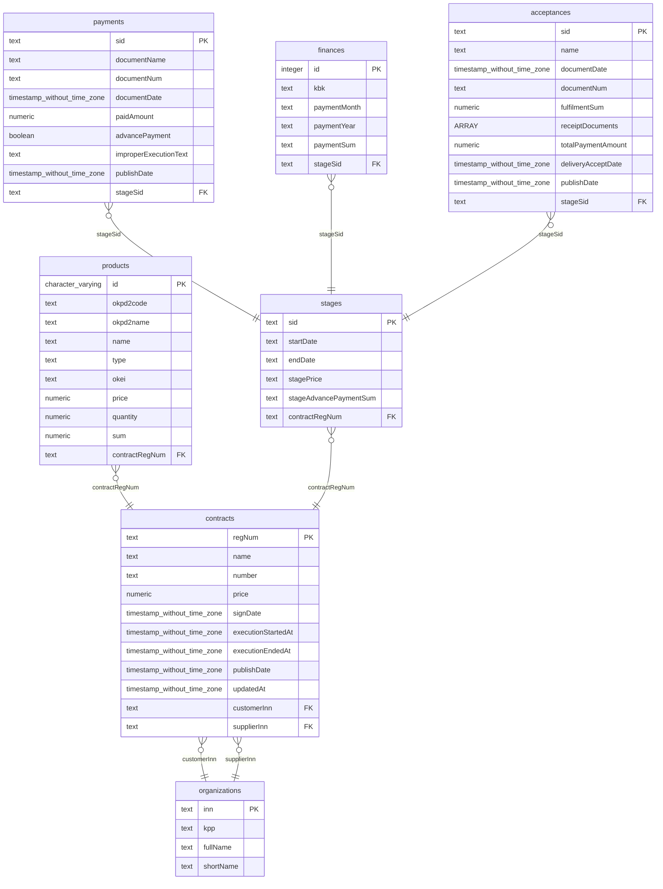

```mermaid
erDiagram
    contracts {
        text regNum PK
        text name
        text number
        numeric price
        timestamp_without_time_zone signDate
        timestamp_without_time_zone executionStartedAt
        timestamp_without_time_zone executionEndedAt
        timestamp_without_time_zone publishDate
        timestamp_without_time_zone updatedAt
        text customerInn FK
        text supplierInn FK
    }

    products {
        character_varying id PK
        text okpd2code
        text okpd2name
        text name
        text type
        text okei
        numeric price
        numeric quantity
        numeric sum
        text contractRegNum FK
    }

    organizations {
        text inn PK
        text kpp
        text fullName
        text shortName
    }

    stages {
        text sid PK
        text startDate
        text endDate
        text stagePrice
        text stageAdvancePaymentSum
        text contractRegNum FK
    }

    payments {
        text sid PK
        text documentName
        text documentNum
        timestamp_without_time_zone documentDate
        numeric paidAmount
        boolean advancePayment
        text improperExecutionText
        timestamp_without_time_zone publishDate
        text stageSid FK
    }

    finances {
        integer id PK
        text kbk
        text paymentMonth
        text paymentYear
        text paymentSum
        text stageSid FK
    }

    acceptances {
        text sid PK
        text name
        timestamp_without_time_zone documentDate
        text documentNum
        numeric fulfilmentSum
        ARRAY receiptDocuments
        numeric totalPaymentAmount
        timestamp_without_time_zone deliveryAcceptDate
        timestamp_without_time_zone publishDate
        text stageSid FK
    }

    products }o--|| contracts : "contractRegNum"
    contracts }o--|| organizations : "customerInn"
    contracts }o--|| organizations : "supplierInn"
    stages }o--|| contracts : "contractRegNum"
    payments }o--|| stages : "stageSid"
    finances }o--|| stages : "stageSid"
    acceptances }o--|| stages : "stageSid"
```
