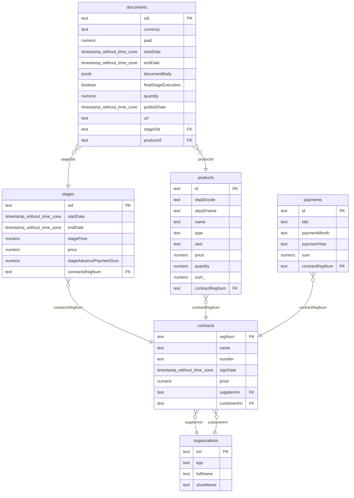

```mermaid
erDiagram
    organizations {
        text inn PK
        text kpp
        text fullName
        text shortName
    }

    contracts {
        text regNum PK
        text name
        text number
        timestamp_without_time_zone signDate
        numeric price
        text supplierInn FK
        text customerInn FK
    }

    stages {
        text sid PK
        timestamp_without_time_zone startDate
        timestamp_without_time_zone endDate
        numeric stagePrice
        numeric price
        numeric stageAdvancePaymentSum
        text contractsRegNum FK
    }

    products {
        text id PK
        text okpd2code
        text okpd2name
        text name
        text type
        text okei
        numeric price
        numeric quantity
        numeric sum_
        text contractRegNum FK
    }

    documents {
        text sid PK
        text currency
        numeric paid
        timestamp_without_time_zone startDate
        timestamp_without_time_zone endDate
        jsonb documentBody
        boolean finalStageExecution
        numeric quantity
        timestamp_without_time_zone publishDate
        text url
        text stageSid FK
        text productId FK
    }

    payments {
        text id PK
        text kbk
        text paymentMonth
        text paymentYear
        numeric sum
        text contractRegNum FK
    }

    contracts }o--|| organizations : "supplierInn"
    contracts }o--|| organizations : "customerInn"
    stages }o--|| contracts : "contractsRegNum"
    products }o--|| contracts : "contractRegNum"
    payments }o--|| contracts : "contractRegNum"
    documents }o--|| stages : "stageSid"
    documents }o--|| products : "productId"
```
